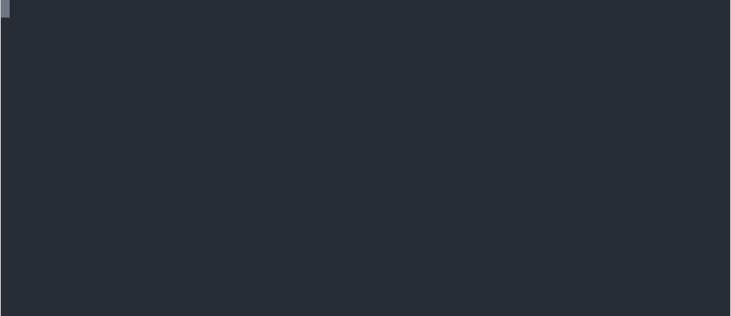
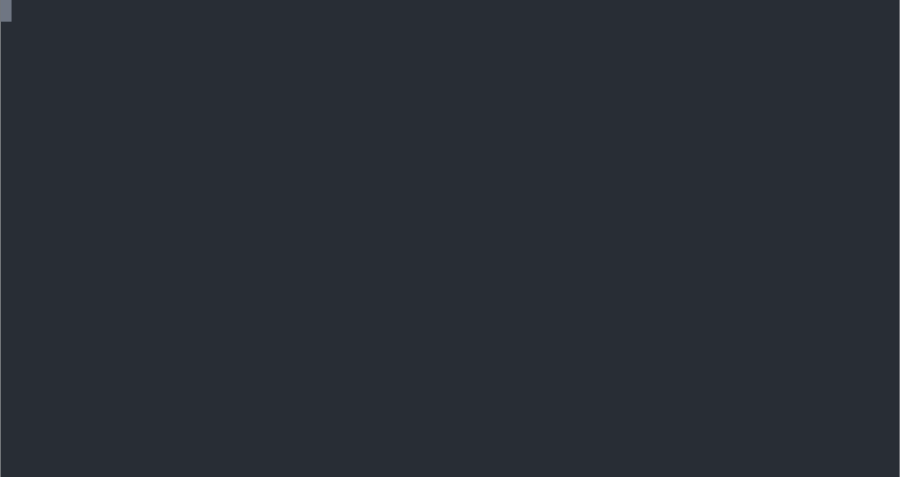
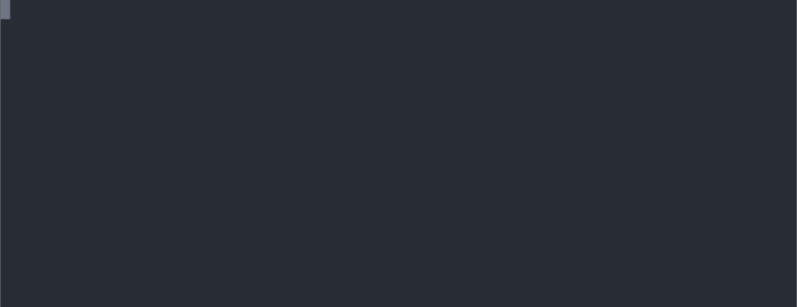
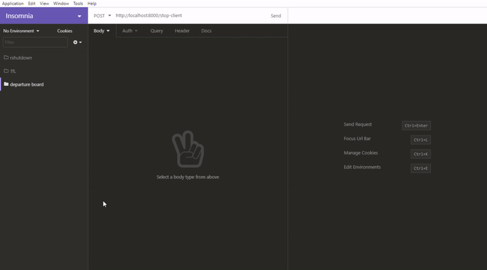
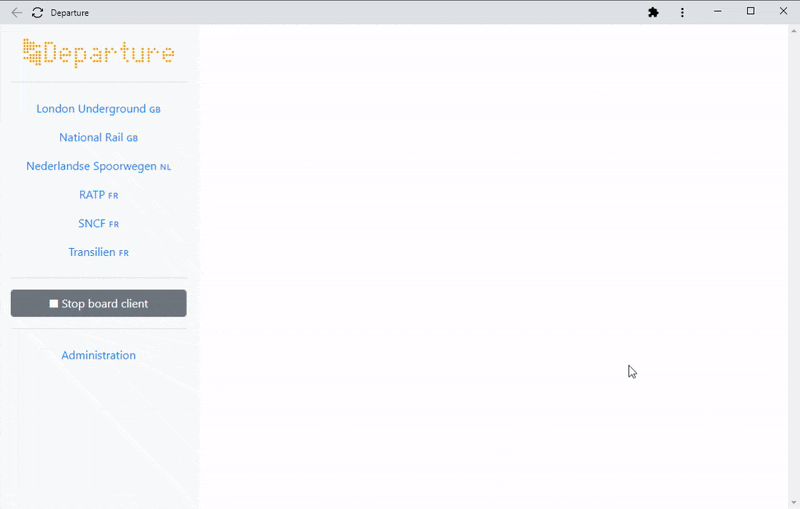

This is the documentation for the Python Departure package.


## Prerequisites

Get API keys for the transport operators you want to get information from:

- National Rail –  Register for access to the National Rail Enquiries OpenLDBWS at http://realtime.nationalrail.co.uk/OpenLDBWSRegistration/, you will receive an email containing a token.
- **TODO**

Install Python.

(Optional, recommended) create a Python virtual environment.


## Installation

Install Python package.


```
$ pip install departure
```

  

## Usage

There are three command line interface tools:

- `departure`, the main CLI, to get station information and departures from public transport operators, and update a virtual or physical departure board with departure information for a station,
- `departure-web`, to run the API web server, optionally with a web front end.
- `departure-server`, to run a Python departure board server, which can receive and display departure information that it has received from the `departure` CLI or the `departure-web` web server.


Before running `departure` or `departure-web`, set the following environment variables (see below for further instructions) for the public transport operators of interest:

- National Rail: set the `LDB_TOKEN` environment variable to your National Rail token.
- **TODO**


To set an environment variable with the name `SOME_VAR` and the value `some_value`:

- Windows: open a Command Prompt, and enter `set SOME_VAR=some_value`. The environment variable will be remembered as long as the Command Prompt is open.
- Linux: open a console, and enter `export SOME_VAR=some_value`. The environment variable will be remembered in the current shell as long as it remains open.


### Main CLI

*Make sure you have set the environment variables you need as described above.*

To get started, display the main CLI's help page.

```
$ departure
```




The following command searches for SNCF (FR) stations containing "Paris".

```
$ departure sncf search paris
```


The following command shows the next departures at Den Haag Centraal (NL).

```
$ departure ns next gvc
```




The following command shows the next Westbound departures on Central Line at Oxford Circus.

```
$ departure lu next ce oxc w
```




The following command updates a departure board with SNCF (FR) departures at Paris Montparnasse.

```
$ departure sncf board 87391003
```

The `departure <operator> board` commands require a running a Departure board server on a physical or virtual departure board – see below for Python Departure board servers and https://github.com/spujadas/departure-board-servers-cpp for C++ Departure board servers.


### Web API server

*Make sure you have set the environment variables you need as described above.*

To start the Departure web API server:

```
$ departure-web
```

The server will run on port 8000, e.g. if installed locally browse to http://localhost:8000.


The OpenAPI documentation can be found at `/docs`, e.g. http://localhost:8000/docs.


Here is a sample cURL command to update a board, in this case with departure information for Montparnasse SNCF station (FR):

```
$ curl -X POST http://localhost:8000/sncf/start-client -d "{\"stop_area_id\": \"87391003\"}"
```


Alternatively, you can use a REST GUI client, such as [Insomnia](https://insomnia.rest/) (shown below) or [Postman](https://www.postman.com/).




#### Web front end

To use the Departure web front end:

- Download a release of the front-end from the Releases page of the [Departure front end](https://github.com/spujadas/departure-front-end) repository, and extract it to any directory.
- Point the `DEPARTURE_STATIC_WEBROOT` environment variable to the directory you have just extracted the Departure front end to.
- Start the web API server (`departure-web`, see previous section).
- Browse to the server on port 8000, e.g. http://localhost:8000.




### Departure board server

To run a Python Departure board server on a virtual or physical departure board, you will first need to install one or several [Python back ends](https://github.com/spujadas/departure-board-servers-python).

Run the following command to list the available back ends.

```
$ departure-server
```


## About

Written by [Sébastien Pujadas](https://pujadas.net/), released under the [MIT license](https://github.com/spujadas/departure-python/blob/master/LICENSE).

All product names, logos, and brands are property of their respective owners. All company, product and service names used in this project are for identification purposes only. Use of these names, logos, and brands does not imply endorsement.

The National Rail engine is powered by [National Rail Enquiries](https://www.nationalrail.co.uk/). The built-in list of National Rail station codes was derived from https://www.nationalrail.co.uk/stations_destinations/48541.aspx.

